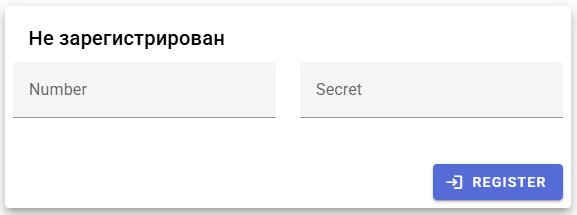
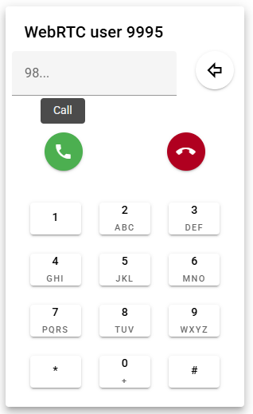
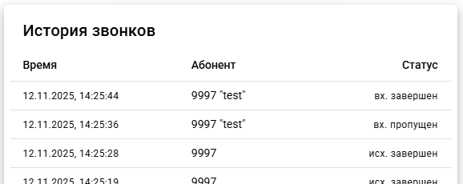
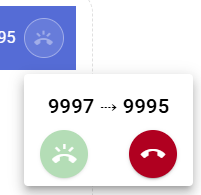

# sipjs-vue
WebRTC телефон на базе библиотеки sipjs


# phone
Готовая сборка в [phone/dist](phone/dist)

```powershell
cd phone
npm install
npm run dev
```

## PhoneReg.vue


## PhonePad.vue


## PhoneHistory.vue


## PhoneControl.vue


## package.json
Обновиться

```powershell
cd phone
npm install --save vue vuetify
npm install --save @fontsource/roboto @mdi/font
npm install --save sip.js
npm install --save-dev vite vite-plugin-vuetify @vitejs/plugin-vue
npm install --save-dev pinia
npm install --save-dev sass-embedded unplugin-fonts unplugin-vue-components
```

## tools
Использую Node.js + Vite, см. [tools](tools)